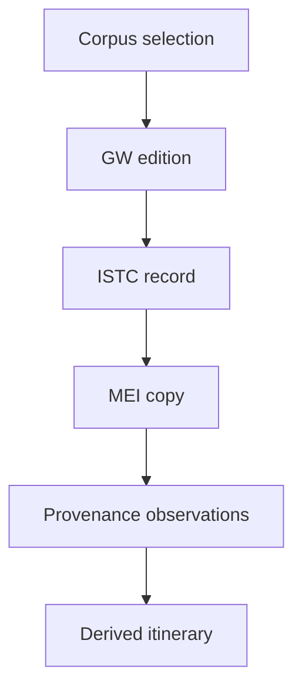

# Initial data model

## Purpose

This document describes the initial relationship between the catalogue records used in *Prayer Books in Motion*. It is intended to prevent the conflation of works, editions and individual surviving copies.

## Data levels

| Level | Principal identifier | Function in the project |
|---|---|---|
| Corpus selection | GW title or heading | Defines which prayer-book editions are included |
| Edition | GW identifier | Provides the initial bibliographic reference |
| Edition | ISTC identifier | Connects the GW record with CERL data |
| Individual copy | MEI identifier | Identifies a particular surviving copy |
| Provenance observation | Recorded within MEI | Associates a copy with people, institutions, places and dates |
| Derived itinerary | Project-generated | Orders available geographical observations for visualisation |

## Important distinctions

### Work or corpus heading

A heading such as *Horae* can group numerous editions. Additional prayer books may be recorded in the GW under their own titles. The project will retain the title forms used by GW or, where necessary, ISTC rather than introduce a new classification system.

### Edition

A GW or ISTC record normally describes an edition, not an individual physical object. The precise correspondence between GW and ISTC records must therefore be checked rather than assumed in every case.

### Copy

A MEI record describes an individual surviving copy. Multiple MEI copies may be connected with the same ISTC edition.

### Provenance observation

A provenance statement records evidence for an association between a copy and a person, institution or place. Dates may be exact, approximate or absent.

### Derived itinerary

The visualised movement of a copy is an interpretation derived from ordered provenance observations. It must remain distinguishable from the source data and should not imply continuous knowledge of a copy’s location.

## Working principle

Source data and project-generated data will be kept separate. Catalogue identifiers, original terminology and links to source records will be preserved wherever possible.
